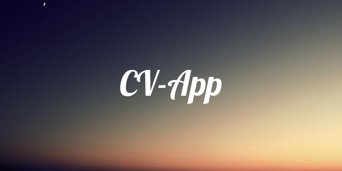

  

# CV-APP

This project is a web application which helps generate a CV based on details inputted by the user

## Highlight

This project utilizes JSPDF as well as HTML2CSS to allow users to download their resume's

## My personal Takeways
This was my first project built using React, Learning how to use functional components and handling states for the first time and gaining familarity with using react. 
I also styled the entire project using TailwindCSS for the first time which was a fun experience.

## How to Use

Use this link to access the live preview link: https://aaronlrv.github.io/cv-app/ or view the latest github pages deployment of the project

## Tech/ Framework Used

 

 
    

## Future Implementations
Add delete education feature where you can delete a tab of education

Add delete work-experience feature where you can delete a tab of education

Enchance quality of PDF downloads

Allow for multiple resume templates

## Contact info
Feel free to contact me here! aaronvitharanage@gmail.com
